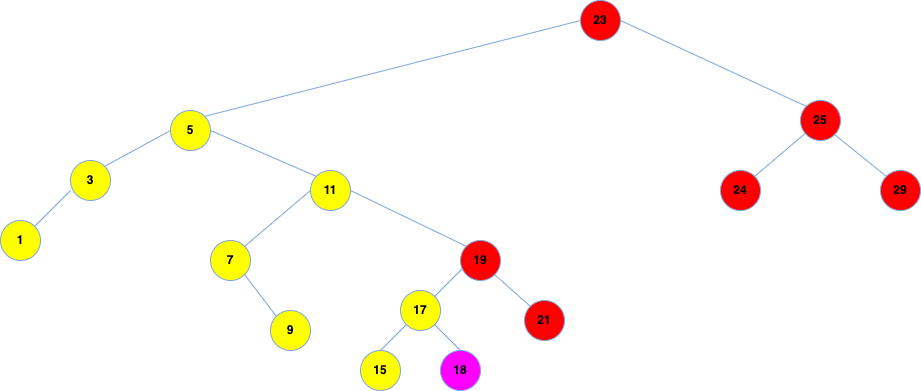
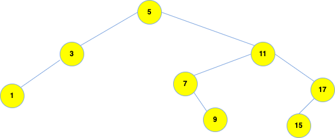

# Split BST with user key

---

### Overview

Given an initial binary search tree, and a user selected key, we are asked to 
dissect the tree to two new ones. We want the first to keep all the original 
tree's keys that are less than the user keys. We want the second to keep the 
remaining keys (more or equal).

This elegant recursive, *O(log h)* algorithm, implemented in **C** language, 
existing in **split_BST** function, solves this problem.

I wrote this algorithm in 2019 for a CS assignment. Back then I searched the
web, and found only iterative solutions, which I did not like.

---
---
---

### Execution

Follow the steps:

    % cd to/code/dir
    % mkdir build_dir_name
    % cmake -S . -B build_dir_name
    % cmake --build build_dir_name
    % build_dir_name/splitBST

---
---
---

### Example in main.c

In the main() function, we have an example tree set up. We can describe its 
splitting process for understanding reasons here.  

The original tree is the following and the key with which we are asked to 
split it is *18*.

---

So the way the original tree should be dissected is as follows, with red keys
being larger than the split key, and yellow keys smaller.

---

Our algorithm, as seen in the execution, results in the following two new trees.

#### Less keys tree

#### More or equal keys tree

---

The split is evident in main()'s output:

    The initial tree:
    Level 1: {23}
    Level 2: {5}{25}
    Level 3: {3}{11}{24}{29}
    Level 4: {1}{7}{19}
    Level 5: {9}{17}{21}
    Level 6: {15}{18}
    
    The 1st subtree(all keys LESS than 18):
    Level 1: {5}
    Level 2: {3}{11}
    Level 3: {1}{7}{17}
    Level 4: {9}{15}
    
    The 2nd subtree(all keys MORE than 18):
    Level 1: {23}
    Level 2: {19}{25}
    Level 3: {18}{21}{24}{29}
